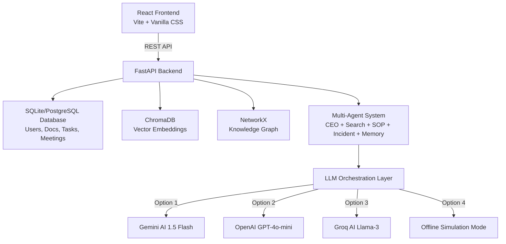

# ProcessPilot AI — Enterprise Knowledge & Operations Copilot

ProcessPilot AI is a next-generation Enterprise Knowledge and Operations Copilot platform. It bridges the gap between unstructured company knowledge (PDFs, transcripts, SOPs) and day-to-day team operations by combining **Multi-Agent RAG (Retrieval-Augmented Generation)**, **Knowledge Graphs**, **Meeting Intelligence**, and **Dynamic Team Analytics**.

Designed for modern team structures, ProcessPilot AI enables managers to oversee workloads, reassign tasks instantly via a Kanban board, analyze meeting transcripts to extract action items automatically, and chat with a context-aware AI Copilot that references both documents and relational organizational graphs.

---

## 🌍 Real-World Impact: How It Helps

In typical corporate environments, information is fragmented across document drives, chat histories, meeting transcripts, and task management systems. ProcessPilot AI solves this by:

1. **Eliminating Document Search Overhead**: Instead of manually digging through PDFs or wiki pages, employees use the **AI Copilot** to get direct answers backed by source citations.
2. **Automating Meeting Synthesis**: HR and product managers can paste raw meeting transcripts, and the system automatically extracts summary points and creates actionable tasks on the Kanban board.
3. **Enhancing Managerial Visibility**: Managers see exactly what their team is working on, monitor workload distributions (Done, In Progress, Pending), and can reassign tasks to load-balance team members in real-time.
4. **Securing Team Boundaries**: Employees are protected under an Attribute-Based Access Control (ABAC) layer, meaning they can only view documents, tasks, and meetings relevant to their department or team structure.

---

## 🛠️ Feature Mapping to Tech Stack

ProcessPilot AI is built on a highly modular full-stack architecture. Here is how each feature maps to its underlying technology:

| Feature Area | Key Capability | Tech Stack Component |
| :--- | :--- | :--- |
| **Interactive AI Copilot** | Context-aware chat interface with source citations and multi-agent pipeline steps visualization. | React Frontend, FastAPI, Gemini/GPT-4o/Llama-3, custom Agent State Machine |
| **Hybrid Graph-RAG** | Retreival that traverses relational structures (departments, technologies, and files) in tandem with vector search. | ChromaDB (Vector Store), NetworkX (Relational Graph Database), SQLite/SQLAlchemy |
| **Meeting Intelligence** | Structured LLM parsing of transcripts to auto-summarize and generate tasks. | Pydantic Schemas, FastAPI backend, LLM JSON Mode |
| **Task Kanban Board** | Drag-and-drop workspace task state updates, manager reassignments, and team assignee badges. | React State Management, HTML5 drag-and-drop, SQLite Relational database |
| **Manager Analytics Console**| Dynamic graphs of team workloads, team member directories, and documentation health scores. | CSS charts/visualizations, scoped SQL analytics queries, React components |
| **HR Team Operations** | Dynamic manager assignment on registration, team transfer, and member release operations. | SQLAlchemy models (Self-referential relationships), React forms |
| **Security & Auditing** | Strict Attribute-Based Access Control (ABAC) enforcing data boundary safety. | FastAPI Security dependencies, custom ABAC policy engines |
| **Database Migrations** | Safe upgrades and rollback pathways for relational database schemas. | Alembic Migrations |

---

## 📐 System Architecture

The following diagram illustrates how the frontend web console interacts with the backend Python API, vector stores, knowledge graph, and agents:



---

## 📁 Repository Structure

### Backend Modules (`/backend`)
* `backend/app/config.py`: Application settings, JWT secrets, and DB URLs.
* `backend/app/database.py`: SQLAlchemy engine, session configurations, and connections.
* `backend/app/models.py`: Declares the 8 core tables: `Users` (with self-referential `manager_id`), `Departments`, `Documents`, `Chunks`, `Meetings`, `Tasks`, `AgentLogs`, and `Memories`.
* `backend/app/schemas.py`: Pydantic request and response schemas.
* `backend/app/auth.py`: JWT generation, password hashing, and user authentication.
* `backend/app/abac.py`: Centralized security policy engine handling access boundaries.
* `backend/app/ingestion.py`: Extraction and chunking logic for PDF, DOCX, and TXT files.
* `backend/app/vectorstore.py`: Vector store adapter layer supporting Chroma, Pinecone, and Qdrant.
* `backend/app/knowledge_graph.py`: NetworkX-based cooperative locking relational graph.
* `backend/app/agents.py`: Orchestration graph of specialized agents (CEO, SOP, Incident, Memory, Search).
* `backend/app/analytics.py`: Role-scoped team operations metric calculations.
* `backend/seed_demo.py`: Script to populate the database with complete enterprise seed data.

### Frontend Pages (`/frontend/src/pages`)
* `Login.jsx` & `Register.jsx`: Split-screen authentication views with dynamic manager dropdowns.
* `Dashboard.jsx`: Console dashboard displaying stats, document health, and telemetry graphics.
* `Documents.jsx`: File upload area and directory filters.
* `Chat.jsx`: AI Copilot interface displaying message history, citations, and agent steps.
* `Meetings.jsx`: Form to analyze transcripts and display generated actions.
* `Tasks.jsx`: Kanban columns with cards, assignee indicators, status cycling, and reassignments.
* `Analytics.jsx`: Team progress charts, activity logs, and workload directories.
* `Settings.jsx`: Dynamic API Key configuration and system prompt overrides.

---

## 🚀 Installation & Setup

### Option A: Running from a Cloned Git Repository

#### Prerequisites
* Python 3.10 or higher
* Node.js v16 or higher

#### 1. Setup Backend
Open a terminal in the `/backend` folder:
```bash
# 1. Create a virtual environment
python -m venv .venv

# 2. Activate the virtual environment
# On Windows:
.venv\Scripts\activate
# On macOS/Linux:
source .venv/bin/activate

# 3. Install dependencies
pip install -r requirements.txt

# 4. Run database migrations to create tables
alembic upgrade head

# 5. Seed the database with corporate demo data
python seed_demo.py

# 6. Start the development server
python run.py
```
> The backend API will start at **http://localhost:8000**

#### 2. Setup Frontend
Open a new terminal in the `/frontend` folder:
```bash
# 1. Install packages
npm install

# 2. Start Vite development server
npm run dev
```
> The frontend application will start at **http://localhost:5173**

---

### Option B: Running from a Downloaded ZIP / Offline Package

If you downloaded the code as a ZIP file:
1. Extract the folder to your local desktop.
2. Follow the setup steps under **Option A**.
3. **Running Offline (Simulation Mode)**: If you do not have an active OpenAI, Gemini, or Groq API key, log in as **Admin** (`admin@processpilot.ai` / `admin123`), navigate to **Settings**, and ensure the model is set to **Offline Simulation Mode**. The platform will simulate responses without hitting external APIs!

---

## 📖 Guided Online Demo Tutorial (Step-by-Step)

If you are demoing the live system online, follow this walkthrough to experience all features:

### Step 1: Log in as a Team Manager
1. Navigate to the login page.
2. Enter the credentials for **Sarah Jenkins** (Engineering Manager):
   * **Email**: `sarah@processpilot.ai`
   * **Password**: `sarah123`
3. Click **Login**. You will land on the Dashboard where you can see engineering-focused workspace metrics.

### Step 2: Review and Reassign Tasks
1. Go to the **Tasks** page on the sidebar.
2. You will see a Kanban board displaying tasks assigned to Sarah and her engineering team (John and Rohan).
3. Click on the **Assignee** dropdown at the bottom of any task card. Reassign a task from *John Doe* to *Rohan Mehta*.
4. Drag a card from **In Progress** to **Completed**. The dashboard updates instantly.

### Step 3: Extract Tasks from a Meeting Transcript
1. Click on **Meetings** in the sidebar.
2. Click **Create Meeting** at the top right.
3. Enter a title (e.g., "Weekly Sync") and paste a mock transcript:
   ```text
   Sarah: Welcome John and Rohan to our weekly sync.
   Sarah: John, please write the database connection string fixes by Thursday.
   Rohan: I will handle updating the API documentation.
   Sarah: Sounds good! Let's get it done.
   ```
4. Click **Submit**. The system parses the transcript, extracts a summary, and creates the two tasks assigned to John and Rohan.
5. Click **Tasks** in the sidebar to verify the new items are on the Kanban board.

### Step 4: Ask the Copilot
1. Click on **Chat (AI Copilot)** in the sidebar.
2. Ask a question: `What tasks are currently assigned to Rohan?` or `What databases are we using in our architecture?`
3. Expand the **Agent Steps** container to see how the multi-agent system evaluated your query.
4. Review the source citations showing where the AI extracted its answers.

### Step 5: Check Team Analytics
1. Navigate to the **Analytics** page.
2. View the **Team Workload** bar chart showing task distributions for John and Rohan.
3. Click on a teammate in the directory list to expand their detailed task checklist.

---

## 🔑 Demo Credentials

The seeded database contains a structured mock company reporting to **Sarah Jenkins** (Engineering Manager) and **Mark Somerhalder** (HR/Finance Manager):

| Role | Name | Email | Password | Reports To | Department / Cost Center |
| :--- | :--- | :--- | :--- | :--- | :--- |
| **Admin** | Admin Principal | `admin@processpilot.ai` | `admin123` | *Independent* | IT-001 |
| **Manager** | Sarah Jenkins | `sarah@processpilot.ai` | `sarah123` | *Independent* | ENG-001 (Engineering) |
| **Manager** | Mark Somerhalder | `mark@processpilot.ai` | `mark123` | *Independent* | HR-001 (HR & Finance) |
| **Employee** | John Doe | `john@processpilot.ai` | `john123` | Sarah Jenkins | ENG-001 |
| **Employee** | Rohan Mehta | `rohan@processpilot.ai` | `rohan123` | Sarah Jenkins | ENG-001 |
| **Employee** | Alice Vance | `alice@processpilot.ai` | `alice123` | Mark Somerhalder | OPS-001 |
| **Employee** | Emma Watson | `emma@processpilot.ai` | `emma123` | Mark Somerhalder | HR-001 |
| **Employee** | Elena Rostova | `elena@processpilot.ai` | `elena123` | Mark Somerhalder | OPS-001 |
