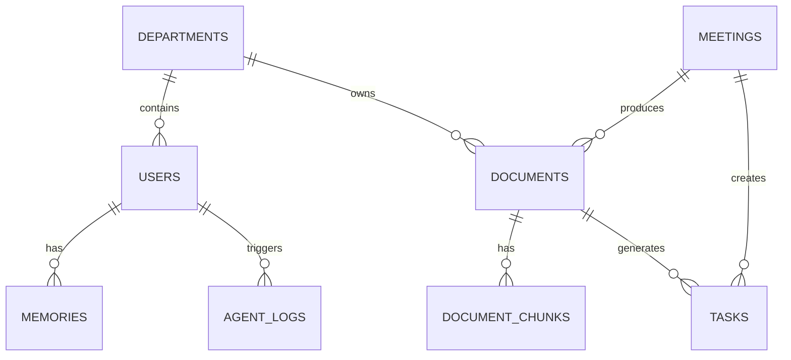

# Project Proposal & Architecture Plan: ProcessPilot AI

This document analyzes and compares **NeuroSphere X** and **ProcessPilot AI**, selecting the optimal project to maximize CV appeal, LinkedIn visibility, and career opportunities in GenAI/AI engineering. It then details the refined architecture and implementation roadmap for the selected project.

---

## 1. Project Comparison: NeuroSphere X vs. ProcessPilot AI

| Metric | NeuroSphere X (Personal Knowledge OS) | ProcessPilot AI (Enterprise Knowledge Copilot) | Winner |
| :--- | :--- | :--- | :--- |
| **Market Segment** | Consumer / B2C Prosumer | B2B SaaS / Enterprise Operations | **ProcessPilot AI** |
| **Resume & CV Appeal** | High (Shows individual productivity tool building) | **Massive** (Solves real corporate productivity & data-silo problems) | **ProcessPilot AI** |
| **Interview Talking Points** | Focuses on personal workflows, note-taking, self-learning. | Focuses on **compliance, role-based security (RBAC), multi-source integrations (Jira, Confluence), and operational efficiency**. | **ProcessPilot AI** |
| **Complexity & Stack** | LangGraph, RAG, Memory, Neo4j, Vector DB. | LangGraph, RAG, Memory, Neo4j, Vector DB, **plus RBAC, Whispering, Ticket integration, and Analytics**. | **ProcessPilot AI** |
| **Commercial Viability** | Low-Medium (Crowded space: Notion, Obsidian, NotebookLM) | **High** (Enterprises pay hundreds of thousands for knowledge engines) | **ProcessPilot AI** |

### Why ProcessPilot AI wins:
Engineering managers and startup founders hire engineers to solve **business problems**. While building a personal second brain is cool, building an **Enterprise Knowledge Copilot** demonstrates that you understand:
1. **Security & Permissions**: Crucial in real-world software.
2. **Integration Complexity**: Merging data from Confluence, Jira, PDFs, and meeting recordings.
3. **Actionability**: Not just answering questions, but automating Standard Operating Procedures (SOPs) and resolving incidents.

---

## 2. The Refined Product: ProcessPilot AI (Enterprise Knowledge & Operations OS)

We will build an upgraded version of **ProcessPilot AI** that integrates the best aspects of **NeuroSphere X** (Knowledge Graph, Advanced memory, and Recommendations) to create a premium SaaS product.

### Core Modules & Tech Stack

```
   [React Frontend] (Tailwind / CSS Components / Recharts)
          │
          ▼
   [FastAPI Backend] (REST API / WebSockets / LangGraph / PyJWT)
    ├── PostgreSQL (Users, Permissions, Metadata, Logs, Tasks)
    ├── ChromaDB (Vector Search, Semantic Embeddings)
    └── Neo4j (Knowledge Graph: Employees ↔ Departments ↔ SOPs ↔ Incidents)
```

### 1. Ingestion Pipeline
* **Inputs**: PDFs, DOCX, TXT, CSV, PPTX, and audio meeting logs (transcribed via Whisper).
* **Processing**: Chunking, generating embeddings, indexing in **ChromaDB**, and parsing structured relationships into **Neo4j**.

### 2. Multi-Agent System (LangGraph)
* **Search Agent**: Semantic retrieval over ChromaDB.
* **Graph Agent**: Queries relationships (e.g., "Who owns this service?", "What documents belong to HR?").
* **SOP Agent**: Compiles standard operating procedures and formats markdown docs.
* **Incident Agent**: Matches issues with past ticket logs and resolutions.
* **CEO Agent**: Synthesizes inputs from all agents, verifies access level, and crafts the final response.

### 3. Enterprise & SaaS Features
* **Role-Based Access Control (RBAC)**: Roles like Admin, Manager, and Employee determine document access.
* **Meeting Intelligence**: Upload meeting audio, auto-transcribe, and generate tasks/decisions.
* **Analytics Dashboard**: Visualization of documentation health, popular topics, missing information gaps, and search trends.
* **SOP Generator**: Interactive agent-guided creation of company SOPs.

---

## 3. Database Schema Design (PostgreSQL)



### Tables

1. **`users`**: `id`, `email`, `hashed_password`, `role` (Admin/Manager/Employee), `department_id`, `created_at`
2. **`departments`**: `id`, `name`, `description`
3. **`documents`**: `id`, `title`, `file_path`, `file_type`, `department_id`, `uploaded_by`, `created_at`
4. **`document_chunks`**: `id`, `document_id`, `content`, `chunk_index`, `metadata`
5. **`meetings`**: `id`, `title`, `transcript`, `summary`, `uploaded_by`, `created_at`
6. **`tasks`**: `id`, `title`, `description`, `status` (Pending/In_Progress/Completed), `assigned_to`, `document_id`, `meeting_id`, `created_at`
7. **`agent_logs`**: `id`, `user_id`, `query`, `response`, `agent_steps` (JSON), `timestamp`
8. **`memories`**: `id`, `user_id`, `key`, `value`, `updated_at`

---

## 4. Phase-by-Phase Development Roadmap

### Phase 1: Foundation (Tech: FastAPI, PostgreSQL, SQLite/DevDB, JWT, React)
* Set up directory structure for Monorepo (frontend & backend).
* Implement Authentication (JWT, User models, password hashing, roles).
* Implement User Profile & Settings dashboard in React.
* Create basic routing & state management.

### Phase 2: Ingestion & Vector Storage (Tech: PyMuPDF, ChromaDB, HuggingFace/Gemini Embeddings)
* Build document upload endpoints (`POST /documents`).
* Text extractor pipeline (PDF/DOCX/TXT).
* Chunking and embedding generation.
* Store vectors in ChromaDB and metadata in PostgreSQL.

### Phase 3: RAG Search & Chat (Tech: LangChain / LlamaIndex, LLM Integration)
* Chat interface in React with Markdown rendering and citations.
* Search engine combining keyword search and semantic vector search.
* Simple CEO agent to answer queries with document citations.

### Phase 4: Meeting Intelligence & Whisper (Tech: Whisper/Groq Whisper API, Celery/Background Tasks)
* Audio upload endpoint.
* Background transcription process.
* LLM action-item and summary extractor.
* Link generated actions directly to project tasks.

### Phase 5: Knowledge Graph Integration (Tech: Neo4j / NetworkX)
* Map entities: User ↔ Department ↔ Document ↔ SOP.
* Hybrid Graph-RAG retrieval (enriching RAG queries with relation maps).

### Phase 6: Multi-Agent Architecture (Tech: LangGraph)
* Design search, incident, SOP, and CEO agents.
* Implement state graph with validation and human-in-the-loop approvals.

### Phase 7: Analytics & Recommendations (Tech: Plotly / Recharts)
* Build interactive charts for search frequency, documentation gaps, and task completion rates.
* Recommendation engine suggesting training materials based on search queries.

---

## Next Steps: Let's Begin Phase 1

To make a fast start, we will:
1. Initialize the backend project directory using FastAPI.
2. Initialize the frontend project directory using React (Vite).
3. Set up the database models and JWT Auth system.
