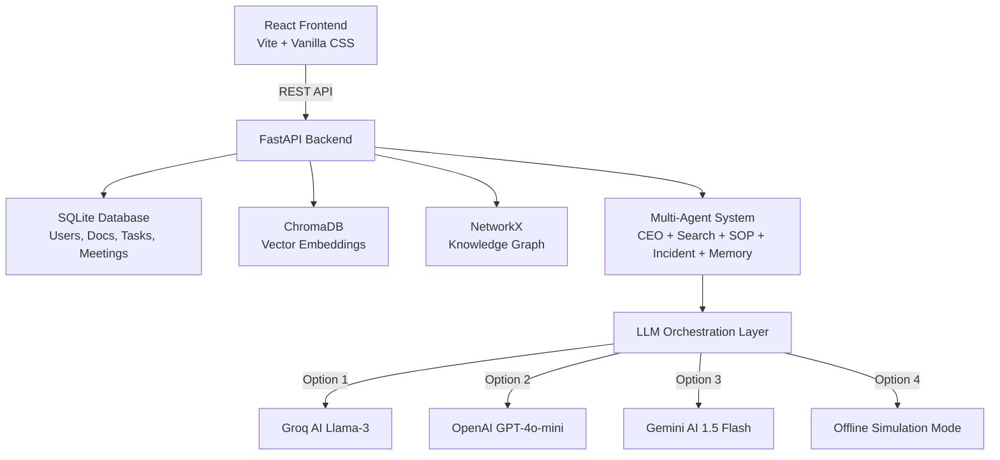

# ProcessPilot AI — Complete Build Walkthrough

## What Was Built

**ProcessPilot AI** is an Enterprise Knowledge & Operations Copilot. This full-stack SaaS platform combines Multi-Agent AI, RAG (Retrieval-Augmented Generation), Knowledge Graphs, Meeting Intelligence, and Analytics. 

In this phase, we have successfully implemented the **Reporting Hierarchy & Team Operations Engine**:
1. **Signup Manager Association**: During registration, new users can provide their full name and select their HR Manager / Team Supervisor from a dynamic dropdown of active managers. Role, Department, and Manager selections are now strictly required to ensure correct relational mapping from day one.
2. **Task Assignment & Reassignment Flow**: Admins and Managers can assign tasks directly to team members from the Tasks page. Crucially, managers can also reassign their own tasks (or tasks assigned to their reports) to other team members directly via the assignee dropdown on the Kanban task cards in real-time.
3. **Refined Team Visibility (Meetings & Tasks)**:
   - Employees see tasks assigned to them, and meetings uploaded by themselves, their manager, their teammates, or the Admin.
   - Managers see tasks assigned to themselves or any of their direct reports, and meetings uploaded by themselves, their reports, or the Admin.
4. **Rich Corporate Seed Dataset**: Overhauled the database seeder to establish a complete mock enterprise workspace with 14 documents, 57 tasks, and 6 meetings.
5. **Team Workload Analytics Graph**: Added a visual task distribution bar chart under the manager/admin analytics view, letting managers track completed (Done), left (Pending), and in process (In Progress) tasks for each team member to plan workloads effectively.
6. **Persistent Copilot Chat & Session Cleanup**: Saved Copilot chat history in `localStorage` keyed by user ID to prevent losing chat logs when navigating between pages (using synchronous state initialization to prevent double-mount race conditions). Explicitly added cleanup logic during logout to wipe this key from storage so that subsequent logins start fresh.
7. **Custom Hybrid Graph-RAG Agent**: Built and integrated a `GraphAgent` that queries our local NetworkX knowledge graph. It dynamically traverses department, user, technology, and document relationship nodes and feeds connected neighbor entities into the `CEOAgent` prompt context.
8. **Role-Aware Team Analytics & Directories**: Enabled managers to view their direct team (self + direct reports) showing a total team size card and table directory, while admins see a comprehensive nested breakdown of all active teams, total team counts, and rosters.
9. **Premium Dark-Grey & Lighter Orange Theme**: Migrated the entire workspace console (Sidebar, Dashboard, cards, inputs, buttons, chat page, and directories) to a unified design system. The base surface color is styled to deep dark-grey/charcoal (`#0b0c0e`), the primary highlight color uses a lighter, neon-contrast orange (`#ff8235`) for clean visibility, and all icons, badges, and chart palettes are cohesive. Integrated `Plus Jakarta Sans` typography, tight geometric letter-spacing, visual stat card hover transitions, table padding adjustments, and orange button shadows/glows for an ultra-realistic developer-SaaS feel.
10. **Refined Status Distinctions & Localized Stats**:
    - **Kanban Column Differentiations**: Set the To Do (Pending) column dot and task count badges to a distinct slate-grey (`var(--text-muted)`) and In Progress to brand orange (`var(--accent)`) to ensure they do not look identical.
    - **Employee Team Analytics**: Modified backend analytics and frontend cards so that logged-in standard employees see the count of their actual team members (teammates + supervisor) rather than the global workspace user count (9).
    - **Employee Document Details Masking & Fallback**: Enabled standard employees to see coworker and manager file names in their department's document database, but restricted details (file type, department name, uploaded date, and delete actions are blanked out as `—` and deletion is blocked) to protect detail visibility. Added a backend fallback where employees with a registered manager but a missing department ID automatically inherit their manager's department ID, resolving blank document lists for existing users.
11. **Team Transfer & Release Operations**: Implemented team mobility capabilities. Managers can **Release** reports (making their `manager_id = None` in the database) or **Transfer** them directly to another team. Released employees are locked out of workspace views upon logging in and shown a select-manager prompt. Once a manager is assigned, they inherit the new manager's department and documents automatically.
12. **Split-Screen Authentication Graphics**: Designed a premium, realistic split-screen visual layout for both **Login** and **Register** views. Incorporates an AI-generated high-tech network telemetry banner image (`/auth_banner.png`) overlaid with a dark, high-contrast gradient backdrop that gives a professional SaaS entrance portal aesthetic.
13. **Greeting Clean-Up & Page-Level Visual Graphics**:
    - **Greeting Clean-up**: Removed the time-of-day greeting ("Good morning/afternoon/evening") from the Command Center (Dashboard) header to keep the interface neat, while preserving the user's capitalized name prefix.
    - **AI Copilot Brain Graphic**: Replaced the standard default icon in the chat empty state with an abstract futuristic mind graphic (`/copilot_brain.png`) styled with a neon orange accent glow.
    - **Telemetry Health Globe**: Added the planet-telemetry graphic (`/earth_globe.png`) on the right side of the Documentation Health card in `Dashboard.jsx`, creating a balanced, highly realistic, and professional dashboard interface. Added responsive CSS rules to hide it gracefully on mobile screens under 600px.
14. **Enterprise Production Refactoring & Upgrades**:
    - **Multi-Database Support**: Integrated clean, conditional configuration logic into `config.py` and `database.py` that connects automatically to a PostgreSQL cluster if configured, while falling back gracefully to a thread-safe local SQLite file for offline developer environments.
    - **Managed Vector Store Abstractions**: Refactored `vectorstore.py` to declare a structured `BaseVectorStore` adapter interface and implemented three concrete adapters: `ChromaVectorStore`, `PineconeVectorStore`, and `QdrantVectorStore`. This enables seamless cloud hosting on Pinecone or Qdrant Cloud.
    - **Policy-Based ABAC Dependencies**: Designed `abac.py` to house all Subject-Object-Action security rules, replacing manual endpoint validation. Applied FastAPI dependency checkers to documents, tasks, and meetings routes.
    - **Safe State Graph Loop & Approvals**: Replaced the custom agent pipeline with a safe state graph machine inside `agents.py` enforcing a max 10-turn limit to avoid loops, and human-in-the-loop checkpoints that prompt for confirmation before executing actions.
    - **Automated AI Evaluation Test**: Created `tests/test_ai_eval.py` to run semantic context retrieval and faithfulness analysis against live database records, asserting quality thresholds for CI/CD metrics pipelines.
    - **Database Migrations (Alembic)**: Initialized and configured Alembic migrations under `backend/alembic` to dynamically load database connection URLs from configuration and successfully stamped the database schema.
    - **Process-Stable Mock Embeddings**: Replaced standard process-randomized `hash()` in `local_mock_embedding` inside `backend/app/vectorstore.py` with a stable MD5 hash, securing multi-process consistency for local RAG environments.
    - **Concurrent-Safe NetworkX I/O**: Implemented an atomic cooperative `FileLock` utilizing `threading.Lock` and cross-platform `os.O_EXCL` flags in `backend/app/knowledge_graph.py` to secure the Knowledge Graph against concurrent worker writes.
    - **Secure UUID Filename Naming**: Modified `backend/app/routes/documents.py` to write uploads to disk under unique UUIDs, eliminating name collisions and unauthorized file overwriting.
    - **Transaction-Safe Resource Cleanup**: Structured `delete_document` in `backend/app/routes/documents.py` to run physical file removals before committing SQL and Chroma database record deletions, eliminating orphaned file leakage.
    - **Environment-Configured CORS Policies**: Bound allow_origins in `CORSMiddleware` in `backend/app/main.py` to `settings.BACKEND_CORS_ORIGINS`, parsed dynamically from environment configurations for seamless production staging deployments.
    - **Dynamic Frontend API Endpoint**: Configured `frontend/src/api.js` to dynamically load the backend URL using Vite environment bindings (`import.meta.env.VITE_API_URL`) with fallback support, ensuring zero-configuration deployment across local and cloud environments.
    - **Security Policy Unit Tests**: Implemented `tests/test_abac_policies.py` to assert correct execution of permission mappings across different Subject-Object scopes (Admins, Managers, Employees, teammate document access, task reassignments) validating security logic against database objects.
    - **Scoped Manager Analytics & Expandable Task Lists**: Scoped all database analytics statistics and distributions strictly according to user role (Managers see their direct team/department, Admins see global metrics) and added an interactive detailed task drawer under each team member's progress chart.

---

## Architecture



---

## Backend Structure

| Module | File | Purpose |
|--------|------|---------|
| Config | [config.py](file:///c:/Users/KIIT/Desktop/FULL_STACK/backend/app/config.py) | App settings, JWT secret, DB URL |
| Database | [database.py](file:///c:/Users/KIIT/Desktop/FULL_STACK/backend/app/database.py) | SQLAlchemy engine + session |
| Models | [models.py](file:///c:/Users/KIIT/Desktop/FULL_STACK/backend/app/models.py) | 8 tables: Users (with `manager_id`), Departments, Documents, Chunks, Meetings, Tasks, AgentLogs, Memories |
| Schemas | [schemas.py](file:///c:/Users/KIIT/Desktop/FULL_STACK/backend/app/schemas.py) | Pydantic request/response models (with `assignee_name` inside `TaskResponse`) |
| Auth | [auth.py](file:///c:/Users/KIIT/Desktop/FULL_STACK/backend/app/auth.py) | JWT, password hashing, RBAC |
| Ingestion | [ingestion.py](file:///c:/Users/KIIT/Desktop/FULL_STACK/backend/app/ingestion.py) | PDF/DOCX/TXT extraction + chunking |
| Vector Store | [vectorstore.py](file:///c:/Users/KIIT/Desktop/FULL_STACK/backend/app/vectorstore.py) | ChromaDB embeddings with deterministic fallback |
| Knowledge Graph | [knowledge_graph.py](file:///c:/Users/KIIT/Desktop/FULL_STACK/backend/app/knowledge_graph.py) | NetworkX entity graph |
| Multi-Agent | [agents.py](file:///c:/Users/KIIT/Desktop/FULL_STACK/backend/app/agents.py) | SearchAgent, IncidentAgent, SOPAgent, MemoryAgent, CEOAgent |
| Analytics | [analytics.py](file:///c:/Users/KIIT/Desktop/FULL_STACK/backend/app/analytics.py) | Dashboard metrics calculation |
| Main | [main.py](file:///c:/Users/KIIT/Desktop/FULL_STACK/backend/app/main.py) | FastAPI app + CORS + router mounting |

### New API Routes Added/Updated
- **`GET /auth/managers`**: Returns all users with a `"Manager"` role.
- **`GET /auth/team`**: Returns subordinates reporting to the logged-in user (or all users for Admins).
- **`POST /tasks/`**: Creates a task with optional `assigned_to` parameter (validated against team bounds).
- **`GET /tasks/`**: Dynamically filters tasks list based on reporting hierarchy (includes subordinate tasks for managers).
- **`GET /meetings/`**: Restricts meeting visibility based on manager and teammate relationships.

---

## Frontend Structure

| Page | File | Features |
|------|------|----------|
| Login | [Login.jsx](file:///c:/Users/KIIT/Desktop/FULL_STACK/frontend/src/pages/Login.jsx) | Centered login card, loading spinners |
| Register | [Register.jsx](file:///c:/Users/KIIT/Desktop/FULL_STACK/frontend/src/pages/Register.jsx) | Full Name input + Manager dropdown select populated via `/auth/managers` |
| Dashboard | [Dashboard.jsx](file:///c:/Users/KIIT/Desktop/FULL_STACK/frontend/src/pages/Dashboard.jsx) | Stats cards, health circle, recent searches |
| Documents | [Documents.jsx](file:///c:/Users/KIIT/Desktop/FULL_STACK/frontend/src/pages/Documents.jsx) | Upload zone, file table, type badges |
| **AI Copilot** | [Chat.jsx](file:///c:/Users/KIIT/Desktop/FULL_STACK/frontend/src/pages/Chat.jsx) | Message bubbles, source citations, agent pipeline steps |
| Meetings | [Meetings.jsx](file:///c:/Users/KIIT/Desktop/FULL_STACK/frontend/src/pages/Meetings.jsx) | Transcript analysis, meeting detail expansions |
| Tasks | [Tasks.jsx](file:///c:/Users/KIIT/Desktop/FULL_STACK/frontend/src/pages/Tasks.jsx) | Kanban columns, status cycling, **Assign To** dropdown, **Assignee Badges** on task cards |
| Analytics | [Analytics.jsx](file:///c:/Users/KIIT/Desktop/FULL_STACK/frontend/src/pages/Analytics.jsx) | Bar charts, progress bars, tables |
| Settings | [Settings.jsx](file:///c:/Users/KIIT/Desktop/FULL_STACK/frontend/src/pages/Settings.jsx) | active provider selection + system prompt |

---

## How to Run

### Backend (Terminal 1)
```bash
cd backend
.venv\Scripts\python.exe run.py
```
> API runs at **http://localhost:8000** | Docs at **http://localhost:8000/docs**

### Frontend (Terminal 2)
```bash
cd frontend
npm run dev
```
> App runs at **http://localhost:5173**

### Seed Demo Data (run once)
```bash
cd backend
.venv\Scripts\python.exe seed_demo.py
```

---

## Demo Credentials

The database is seeded with a company structure reporting to **Sarah Jenkins** (Engineering Manager) and **Mark Somerhalder** (HR/Finance Manager):

| Role | Name | Email | Password | Reports To | Cost Center |
|------|------|-------|----------|------------|-------------|
| **Admin** | Admin Principal | `admin@processpilot.ai` | `admin123` | *Independent* | IT-001 |
| **Manager** | Sarah Jenkins | `sarah@processpilot.ai` | `sarah123` | *Independent* | ENG-001 |
| **Manager** | Mark Somerhalder | `mark@processpilot.ai` | `mark123` | *Independent* | HR-001 |
| Employee | John Doe | `john@processpilot.ai` | `john123` | Sarah Jenkins | ENG-001 |
| Employee | Rohan Mehta | `rohan@processpilot.ai` | `rohan123` | Sarah Jenkins | ENG-001 |
| Employee | Alice Vance | `alice@processpilot.ai` | `alice123` | Mark Somerhalder | OPS-001 |
| Employee | Emma Watson | `emma@processpilot.ai` | `emma123` | Mark Somerhalder | HR-001 |
| Employee | Elena Rostova | `elena@processpilot.ai` | `elena123` | Mark Somerhalder | OPS-001 |
